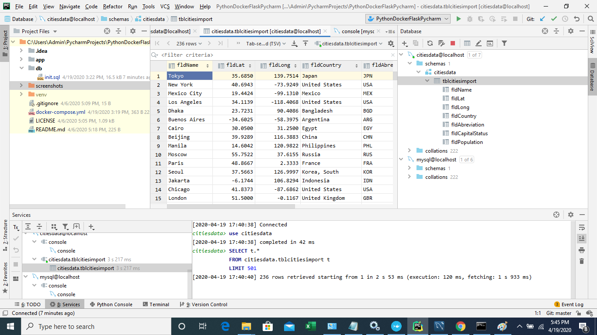
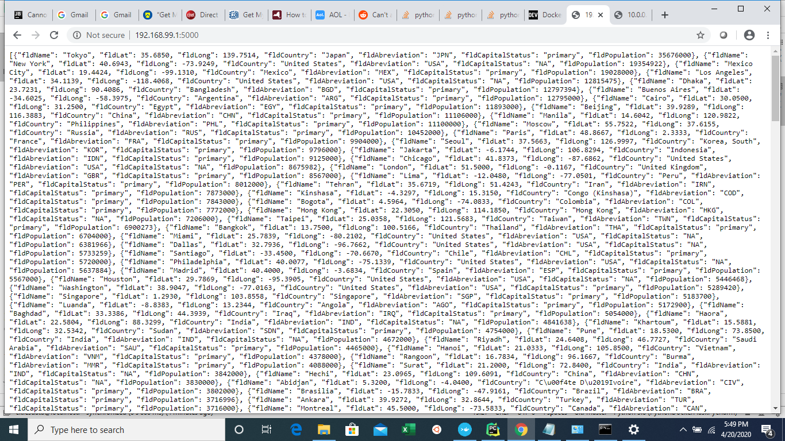
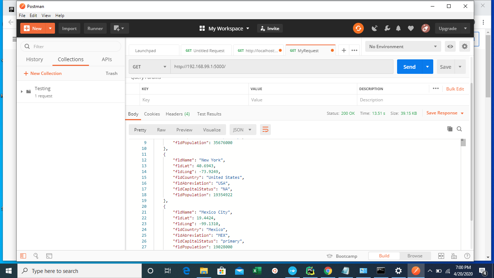

# PythonDockerFlaskPycharm

# Project Description
This project is a homework assignment to teach how to get Pycharm setup with Docker, Flask, MYSQL

# MySQL database table on Pycharm

# JSON output on WebApp

# Postman Screenshot
 